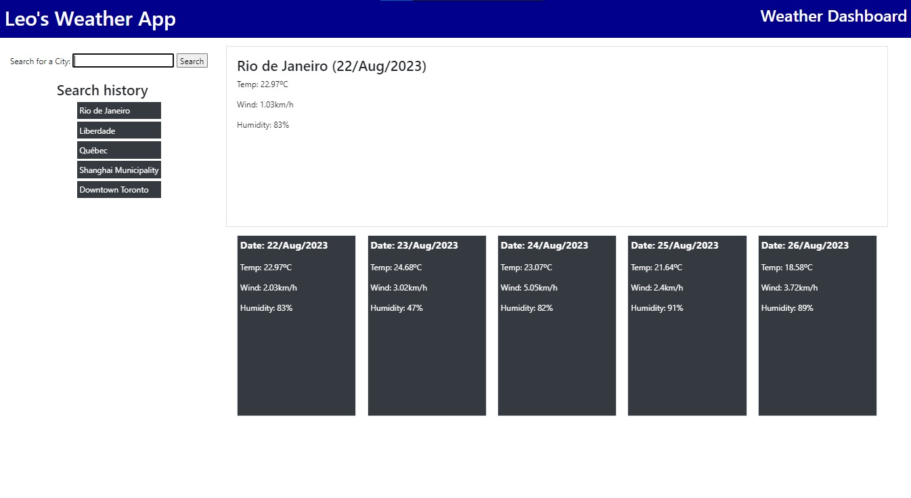

# Leoswheatherapp
A dynamic weather dashboard that can deliver the weather outlook for multiple cities so you can plan your trips without any surprises.

https://leopoldogurgel.github.io/Leoswheatherapp/

## DESCRIPTION

This is a weather application that allows you to instantly check for ther wather of whatever city you want. Just write the name of the city, and watch the magic happen.

## INSTRUCTIONS

This is a single page app. You will be presented with a form in which you will write the name of the city you want to check the weather. After writing it down, either you press the submit button or press enter, the current weather will appear at the top of the page and the weather for the next five days will show right below. The name of the cities you searched will be stored in a search history at the left hand of the page.

## CREDITS

This website is powered with weather condition information provided by the Open Weather Map API (https://openweathermap.org).

## FEATURES

To achieve the current form of the app, most of it took server side API fetch method and a lot of asyncronous functions. Promises to be more specific.

## LICENSE

MIT License

Copyright (c) [2023] [Leopoldo Gurgel Barroso Pimentel]

Permission is hereby granted, free of charge, to any person obtaining a copy
of this software and associated documentation files (the "Software"), to deal
in the Software without restriction, including without limitation the rights
to use, copy, modify, merge, publish, distribute, sublicense, and/or sell
copies of the Software, and to permit persons to whom the Software is
furnished to do so, subject to the following conditions:

The above copyright notice and this permission notice shall be included in all
copies or substantial portions of the Software.

THE SOFTWARE IS PROVIDED "AS IS", WITHOUT WARRANTY OF ANY KIND, EXPRESS OR
IMPLIED, INCLUDING BUT NOT LIMITED TO THE WARRANTIES OF MERCHANTABILITY,
FITNESS FOR A PARTICULAR PURPOSE AND NONINFRINGEMENT. IN NO EVENT SHALL THE
AUTHORS OR COPYRIGHT HOLDERS BE LIABLE FOR ANY CLAIM, DAMAGES OR OTHER
LIABILITY, WHETHER IN AN ACTION OF CONTRACT, TORT OR OTHERWISE, ARISING FROM,
OUT OF OR IN CONNECTION WITH THE SOFTWARE OR THE USE OR OTHER DEALINGS IN THE
SOFTWARE.

